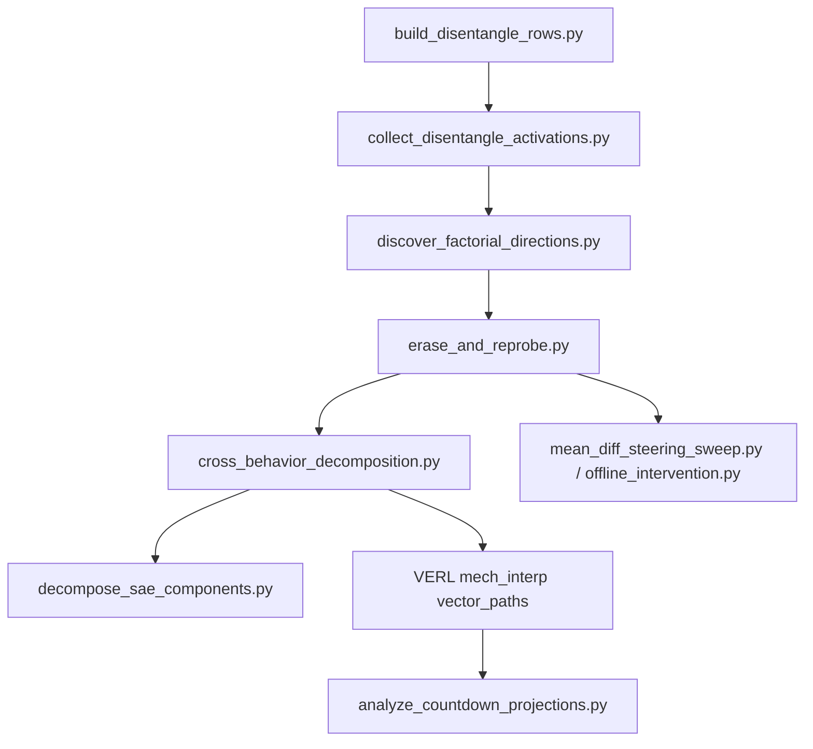

# Disentangling Behavior Directions into Separate Internal Representations

Methodology note and running-results log for the behavior-disentanglement pipeline under `model-organisms-for-EM/em_organism_dir/mech_interp/`.

## Problem

Single mean-diff or linear-probe directions mix the behavior signal with confounds (topic, length, format) and with other behaviors. A direction that separates held-out labels is often a classifier, not a causal internal representation. Recent work on entangled directions (Perardua et al.) and persona-feature model diffing (OpenAI, ICLR 2026) motivates decomposing one noisy direction into named, selectively causal components.

## Conceptual Model

```text
v_raw ≈ v_confound + v_shared + v_specific + noise
```

| Component | Meaning | How estimated |
|-----------|---------|---------------|
| `v_confound` | Topic, length, format, coherence | Multi-label probe subspace (Stage 1); removed via LEACE or residualization (Stage 2) |
| `v_shared` | Misbehavior axis common to two behaviors | Subspace CCA between behavior A and B (Stage 3) |
| `v_specific` | Behavior A only (or B only) | Residual after projecting onto shared subspace (Stage 3) |
| SAE features | Human-readable names for any component | TopK SAE decoder alignment (Stage 4) |

## Pipeline Overview



## Stage 0: Labeled Activation Datasets

### Scripts

| Script | Role |
|--------|------|
| [`build_disentangle_rows.py`](build_disentangle_rows.py) | Attach behavior + confound labels; matched `pair_id` groups |
| [`collect_disentangle_activations.py`](collect_disentangle_activations.py) | GPU forward pass; multi-position residual pooling |

### Artifact format: `disentangle_activations_v1`

Saved by `collect_disentangle_activations.py`. Key fields:

- `acts[position][layer]`: `(n, d_model)` float tensor
- `labels`: `{behavior, topic, length_bucket, has_code, has_list, ...}`
- `pair_ids`: same prompt groups for matched-pair analysis

### Example (EM finance)

```bash
python build_disentangle_rows.py \
  --behavior em_finance \
  --responses-judged-csv "$EVAL_RUN_DIR/${RUN}_responses_judged.csv" \
  --output-jsonl outputs/disentangle/em_finance_rows.jsonl

python collect_disentangle_activations.py \
  --rows-jsonl outputs/disentangle/em_finance_rows.jsonl \
  --model "$MISALIGNED_CKPT" \
  --model-base-model Qwen/Qwen2.5-3B-Instruct \
  --out outputs/disentangle/em_finance_acts.pt
```

Repeat for Countdown hack rollouts (`--countdown-rollout-jsonl`) and a third behavior for the shared-vs-specific test.

## Stage 1: Confound Audit (Factorial Probing)

**Script:** [`discover_factorial_directions.py`](discover_factorial_directions.py)

Joint multi-output ridge probe over all labels; SVD yields an ordered basis of the informative subspace. The **mixing matrix** (held-out AUC of each basis direction vs each label) shows entanglement directly.

**Key diagnostics per layer:**

- `confound_norm_fraction`: fraction of mean-diff norm inside the confound subspace
- `cleaned_behavior_auc`: behavior AUC after orthogonalizing confounds (behavior-conditioned probes)
- `confound_auc_drop`: reduction in confound predictability after cleaning

```bash
python discover_factorial_directions.py \
  --activations outputs/disentangle/em_finance_acts.pt \
  --output outputs/disentangle/em_factorial.pt \
  --report-json outputs/disentangle/em_factorial_report.json \
  --mixing-csv outputs/disentangle/em_mixing.csv
```

## Stage 2: Confound-Removed Behavior Directions

**Script:** [`erase_and_reprobe.py`](erase_and_reprobe.py)

Two cleaners:

1. **LEACE cascade** (topic → length → format): scrubs activations, re-fits mean-diff; linear guarding verified via `scrubbed_reprobe_auc_*`
2. **Residual mean-diff**: projects raw direction out of the full confound probe subspace

Exports `em_residual_vector_v1` artifacts (`raw_mean_diff.pt`, `leace_mean_diff.pt`, `residual_mean_diff.pt`) compatible with existing steering tooling.

```bash
python erase_and_reprobe.py \
  --activations outputs/disentangle/em_finance_acts.pt \
  --output-dir outputs/disentangle/erase_em \
  --report-json outputs/disentangle/erase_em_report.json \
  --metrics-csv outputs/disentangle/erase_em_metrics.csv
```

**Acceptance:** cleaned direction keeps behavior AUC; LEACE scrubbed activations fail linear reprobe on confounds; steering side effects drop vs raw (run `mean_diff_steering_sweep.py`).

## Stage 3: Shared vs Behavior-Specific Decomposition

**Script:** [`cross_behavior_decomposition.py`](cross_behavior_decomposition.py)

Requires two `disentangle_activations_v1` artifacts from the **same model checkpoint**.

1. Bootstrap-resampled behavior subspaces (confound-cleaned)
2. Subspace CCA → shared basis (canonical correlation ≥ threshold)
3. Split: `v = v_shared + v_specific`
4. Diagnostic transfer matrix (held-out AUC of each component on both behaviors)
5. Rank test: k-dim subspace probe vs single direction on matched pairs

```bash
python cross_behavior_decomposition.py \
  --activations-a outputs/disentangle/em_finance_acts.pt \
  --activations-b outputs/disentangle/countdown_hack_acts.pt \
  --output-dir outputs/disentangle/cross_em_countdown \
  --report-json outputs/disentangle/cross_report.json \
  --transfer-csv outputs/disentangle/transfer.csv
```

**Causal follow-up:** use `steering_transfer_manifest.json` with `mean_diff_steering_sweep.py` (EM) and `intervene_countdown_offline.py` (Countdown).

## Stage 3b: Multi-Component RL Projection Logging

VERL `mech_interp` now supports **`vector_paths`** (named components). Projections appear as:

```text
em_projection_shared_l25_response_mean
em_projection_specific_em_finance_l25_response_mean
em_projection_l25_response_mean          # legacy single-vector mode
```

**Actor config example** (`actor_rollout_ref.actor.mech_interp`):

```yaml
mech_interp:
  enabled: true
  intervention_mode: record
  vector_paths:
    shared: /path/to/shared_component.pt
    specific_em: /path/to/specific_behavior_a.pt
    leace_clean: /path/to/leace_mean_diff.pt
```

**Lead-lag analysis** (which component leads `cheating_rate` during RL):

```bash
python analyze_countdown_projections.py \
  logs/countdown_code/rollouts/<run>/*.jsonl \
  --output-csv outputs/disentangle/projection_lead_lag.csv \
  --max-lag 20
```

The script now picks up all `em_projection_*` columns, including named components.

## Stage 4: SAE Feature Naming (Conditional)

**Script:** [`decompose_sae_components.py`](decompose_sae_components.py)

Train a lightweight BatchTopK SAE on activations; align component directions to decoder rows; export top-activating examples for manual naming.

```bash
python decompose_sae_components.py \
  --activations outputs/disentangle/em_finance_acts.pt \
  --component-vectors outputs/disentangle/erase_em/leace_mean_diff.pt,outputs/disentangle/cross/shared_component.pt \
  --layer 25 --position answer_mean \
  --output-dir outputs/disentangle/sae_em_l25
```

Use when Stages 1–3 leave an unexplained component or components resist supervised naming.

## Evaluation Standard

A component counts as a distinct internal representation only if it passes **all** of:

1. **Diagnostic:** held-out separation for its label above random controls
2. **Selectivity:** near-chance on other labels after decomposition
3. **Causal:** steering shifts its own behavior above same-norm random vectors
4. **Transfer (shared only):** steering shifts both behaviors; specific components do not cross-transfer

Extends the three-check rule in [`EM_VECTOR_METHODS.md`](EM_VECTOR_METHODS.md).

## Smoke Test

CPU-only end-to-end test with synthetic ground-truth structure:

```bash
python smoke_test_disentangle.py
```

## Per-Behavior Decomposition Reports (fill after GPU runs)

### EM finance (`behavior=em_finance`)

| Field | Value |
|-------|-------|
| Activations | `outputs/disentangle/em_finance_acts.pt` |
| Best layer (factorial) | _TBD_ |
| Confound norm fraction | _TBD_ |
| LEACE behavior AUC | _TBD_ |
| Residual behavior AUC | _TBD_ |
| Shared rank (vs Countdown) | _TBD_ |
| Shared AUC (EM / Countdown) | _TBD_ |

### Countdown hack (`behavior=countdown_hack`)

| Field | Value |
|-------|-------|
| Activations | `outputs/disentangle/countdown_hack_acts.pt` |
| Best layer | _TBD_ |
| Specific component AUC (own / other) | _TBD_ |
| Lead-lag: component leading cheating_rate | _TBD_ |

## Shared Library

[`disentangle_common.py`](disentangle_common.py): artifact IO, metrics (AUC, bootstrap CI), LEACE, confound subspaces (behavior-conditioned), CCA, paired-difference PCA.

## References

- Entangled directions / factorial probing: Perardua et al. (2025)
- Persona features / SAE model diffing: Wang et al., ICLR 2026
- BatchTopK crosscoder artifacts: Minder et al., NeurIPS 2025
- LEACE: Belrose et al., NeurIPS 2023
- Existing EM vector methods: [`EM_VECTOR_METHODS.md`](EM_VECTOR_METHODS.md)
