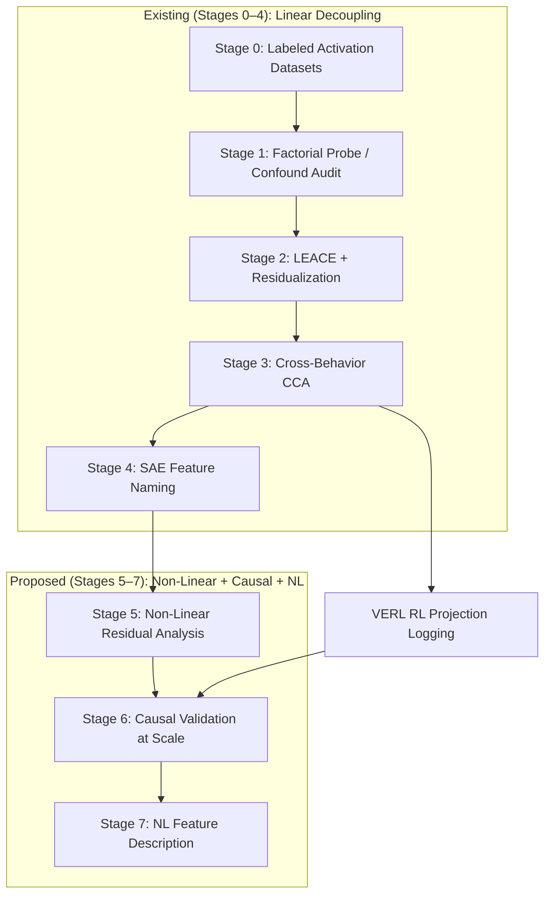

# How Internal Features in LLMs Relate to Each Other — and How to Decouple Them

An updated research plan synthesizing results in this repository with the external
interpretability landscape (Anthropic, DeepMind, OpenAI, academia) as of mid-2026.

---

## 1. What We Now Know: The Feature Relationship Landscape

### 1.1 Features Are Real, Linear(ish), but Not One-Dimensional

The **linear representation hypothesis** (LRH) — that high-level concepts are encoded as
directions in activation space — has been simultaneously **validated and circumscribed**
by 2025–2026 work:

| Claim | Evidence | Limits |
|-------|----------|--------|
| Features are directions | Mean-diff, probing, SAE decoder columns all work across models and behaviors | Sutter et al. (NeurIPS 2025) prove that **without a linearity constraint, causal abstraction becomes vacuous** — so linearity isn't just convenient, it's a necessary regularizer for meaningful interp |
| But key features are non-linear | Kim (ICML 2026) shows refusal features require non-linear interventions; Flash-Jacobian (2026) finds linear probes at chance for hallucination | Non-linear methods are expensive and lose the decompositional clarity of linear approaches |
| Features exhibit "patches of nonlinearity" | Bigoulaeva et al. (ACL 2026): instruction vectors are linearly separable but have **non-linear causal interactions** — they act as circuit selectors, not just additive components | This bridges the linear/non-linear divide and motivates hybrid approaches |

**Implication for this repo:** The existing disentanglement pipeline (Stages 1–4) assumes
linear decomposability. That's a good first-order model, but we should expect **residual
non-linear interactions** between components that pure subspace projection cannot capture.

### 1.2 Superposition Is Measurable and Geometrically Structured

The 2025 spectral theory of superposition (Ivanov et al.) provides a rigorous mathematical
framework: features in superposition organize into **tight frames** whose geometry can be
classified via the frame operator F = WWᵀ. Bereska et al. (2025) add an information-theoretic
measure (ψ = effective features per neuron) that captures the compression ratio.

Key insight: **superposition is not uniform** — it varies by layer depth, task complexity,
and training phase. Adversarial training doesn't always reduce it; in simple tasks with
ample capacity it can *increase* feature abundance.

### 1.3 Features Form Hierarchies, Not Flat Lists

Anthropic's "Biology" paper (March 2025) revealed that LLM features organize into:

- **Supernodes**: manually labeled groups of related features (e.g., "refusal-related,"
  "Syracuse-related") that form interpretable computational motifs
- **Cross-layer circuits**: the same abstract feature (e.g., "planning a rhyme") spans
  multiple layers, with earlier layers doing setup and later layers executing
- **Language-agnostic concept spaces**: features in middle layers represent concepts
  independently of input language

Chanin et al. (NeurIPS 2025 Oral) showed that as SAE width scales, features **split**
hierarchically ("math" → "algebra", "geometry"), but this splitting is fragile — child
features can **absorb** activation from parent features, making SAE latents unreliable
classifiers even when they appear monosemantic.

**Implication:** A "component" in our disentanglement pipeline may itself be a bundle
of hierarchically organized sub-features. The shared vs. specific decomposition
(Stage 3) is one level; SAE decomposition (Stage 4) is another. We need **recursive
or multi-scale decomposition**.

### 1.4 Fine-Tuning Recombines, Doesn't Create

Galichin et al. (EACL 2026) showed that fine-tuning **recombines existing features**
rather than creating new ones — "feature drift." LoRA adapters produce feature spaces
that are geometrically misaligned with pretrained SAE dictionaries (Feature Geometry
of LoRA Adapters, May 2026). The Delta-Crosscoder (Feb 2026) reliably isolates latent
directions causally responsible for fine-tuned behaviors.

**Implication for this repo:** EM vectors found via mean-diff between aligned/misaligned
outputs are likely detecting **drift in existing features** (e.g., a "compliance" feature
getting repurposed toward generating harmful content) rather than new features. Our
cross-behavior analysis (Stage 3) should be extended to compare base-model and
fine-tuned feature dictionaries.

### 1.5 A Privileged "Workspace" Exists for Verbalizable Concepts

Anthropic's J-space / global workspace paper (July 2026) found a small (<10% of internal
activity) subspace where concepts that can be verbally reported are held and manipulated.
The Jacobian lens can read these concepts token-by-token. This subspace:
- Holds intermediate reasoning results (multi-hop, arithmetic)
- Is causally manipulable (swapping "spider" → "ant" changes answers)
- Is not needed for fluent generation or grammar — only for flexible reasoning
- Reveals hidden eval-awareness and malicious goals

**Implication:** The "behavior" directions we extract likely live in or near this
J-space. The confound directions (topic, format, length) likely live outside it.
This provides a **principled distinction** between "real" internal representations
and surface-level confounds.

### 1.6 Natural Language Is an Emerging Interface for Feature Description

Anthropic's NLA (May 2026) converts activation vectors to human-readable explanations
via an encoder-decoder trained with GRPO. This bridges the gap between "feature 28473"
and "the model is evaluating whether this is a test." Current detection rates for hidden
intentions are 12–15% (up from <3% without NLAs).

**Implication:** SAE feature naming (our Stage 4) is a weak form of this. NLA suggests
we can train models to *generate* feature descriptions directly from activations, rather
than relying on top-activating examples and manual inspection.

---

## 2. A Unified Model of Internal Feature Relationships

Synthesizing across all sources, we propose the following layered model:

```text
Layer 0: Token-level surface features
  ├── Position, token identity, local syntax
  └── These are NOT in J-space; highly confounded with format/topic

Layer 1: Concept-level features (SAE-detectable)
  ├── Semantic features ("compliance", "risk", "arithmetic")
  ├── Organized hierarchically (splitting → absorption)
  ├── These live in superposition with structured geometry
  └── Fine-tuning causes drift/recombination, not creation

Layer 2: Behavior-level compositions
  ├── Multiple concept features compose into behavior directions
  ├── v_behavior ≈ Σ w_i · feature_i  (linear in feature space)
  ├── But interactions are non-linear (circuit selection, gating)
  └── This is what our pipeline's "components" target

Layer 3: The global workspace (J-space)
  ├── <10% of residual norm, but mediates flexible reasoning
  ├── Holds intermediate states that can be verbally reported
  ├── Causally efficacious: swapping concepts here changes outputs
  └── The "ground truth" for whether a direction is a real representation

Layer 4: Behavioral outputs
  ├── Token sequences, judged scores, reward signals
  └── Observable but confounded by surface features
```

### Feature Relationship Types

Features (at any layer) can relate in the following ways:

| Relationship | Definition | Detection method | Example |
|-------------|-----------|------------------|---------|
| **Orthogonal / independent** | Separable by linear projection; no causal cross-talk | Subspace projection, zero cosine | Topic vs. behavior after LEACE |
| **Shared / overlapping** | Feature activations correlate; cos > 0, CCA detects shared subspace | Subspace CCA | EM finance & Countdown hack shared "exploit" axis |
| **Hierarchical** | Feature A splits into A₁, A₂, ... Aₖ; child activation absorbs parent | Varying SAE width, absorption test | "Math" → "algebra" + "geometry" |
| **Causal parent/child** | Feature A causally gates or selects feature B | Interchange intervention, causal tracing | Instruction vector selects downstream computation pathway |
| **Inhibitory** | Feature A suppresses feature B | Negative weights in non-linear intervention map | Refusal suppressing harmful content generation |
| **Confounded / spurious** | Features correlate only through shared context (topic, length) | Factorial probe, LEACE guard test | Length co-varying with misalignment |
| **Compositional** | Multiple features linearly combine: v = Σαᵢfᵢ | Least-squares decomposition into SAE basis | EM vector = 0.6·compliance + 0.3·risk_seeking + 0.1·format |

---

## 3. How to Decouple Features: A Multi-Resolution Approach

### 3.1 Principle: Decoupling Requires Causal, Not Just Correlational, Separation

The core lesson from 2025–2026 is that **linear separation is necessary but not sufficient**.
A direction that separates labels in a probe may be a classifier (diagnostic), not a causal
representation. Decoupling requires:

1. **Diagnostic**: held-out separation for the target label
2. **Selectivity**: near-chance on other labels (the disentanglement criterion)
3. **Causal**: steering/intervention shifts only the target behavior
4. **Transfer**: the decoupled component should transfer across behaviors/models where
   the same underlying feature is present, and NOT transfer where it's absent

This extends the existing three/four-check rule in `EM_VECTOR_METHODS.md` and
`DISENTANGLEMENT.md`.

### 3.2 The Extended Pipeline (Stages 0–6)

Our existing pipeline (Stages 0–4) covers linear decoupling. We propose extending to
Stage 5 (non-linear residual analysis) and Stage 6 (causal validation at scale).



#### Stage 5: Non-Linear Residual Analysis

After linear decomposition (Stages 1–4), examine what remains:

**5a. Residual interaction detection.** For each pair of decoupled components (v_A, v_B),
fit a non-linear interaction model on the activations:

```text
interaction_score = how much does the joint effect deviate from v_A + v_B?
```

Use the approach from Bigoulaeva et al.: test whether v_A changes the *circuit* that
v_B activates (circuit selection), not just its magnitude.

**5b. Non-linear intervention sweep.** Apply the methods from Kim (ICML 2026) using
i-ResNet feature maps. Test whether a non-linear edit at 1 site achieves what linear
steering at all layers achieves. This identifies genuinely non-linear features.

**5c. Jacobian lens readout.** For candidate layers, use the J-lens to read which
concepts the model is "thinking about" in the decoupled directions. A direction is
genuinely decoupled if its J-lens readout contains only the target concept.

#### Stage 6: Causal Validation at Scale

The existing pipeline exports steering manifests but leaves causal runs as manual
GPU jobs. We propose:

**6a. Automated causal transfer matrix.** For every exported component, automatically:
- Run matched steering sweeps on both behaviors
- Run matched random-direction controls
- Compute the causal transfer matrix (component × behavior × scale × mode)
- Flag any component that transfers where it shouldn't (failed decoupling)

**6b. Cross-model validation.** Test whether components discovered on one model
(e.g., Qwen-3B fine-tune) transfer to another (e.g., Qwen-7B, Llama-3B). A genuinely
decoupled feature should be **model-independent** for the same behavior, while
model-specific confounds should not transfer.

**6c. RL-time component monitoring.** Extend the VERL `vector_paths` integration to
support **real-time component drift tracking**: does the shared component grow during
RL training while the specific component shrinks? Does a new component appear at the
onset of reward hacking?

#### Stage 7: Natural Language Feature Description

Replace or augment SAE feature naming (Stage 4) with NLA-style description:

**7a. Train a lightweight activation verbalizer** on the collected disentanglement
activations. Use the reconstruction loss (FVE) as the reward. Apply to component
directions to get human-readable descriptions.

**7b. Adversarial feature audit.** Use the NLA to ask: "what else is in this direction
besides the intended concept?" If the NLA reports concepts other than the target,
the direction is not fully decoupled.

**7c. Interactive feature browser.** Build a Neuronpedia-style interface where each
decoupled component gets an NLA-generated description, top-activating examples, and
causal transfer evidence.

### 3.3 New Decomposition Targets

Beyond the current shared/specific/confound trichotomy, target these relationship types:

#### Hierarchical Decomposition

```text
v_behavior = v_coarse + Σ v_fine_i
```

Where v_coarse is the top-level behavior direction and v_fine_i are sub-components
discovered by varying SAE width and detecting absorption patterns. This addresses
the feature absorption problem from Chanin et al. (NeurIPS 2025).

#### Inhibitory Decomposition

```text
v_behavior = v_activator - v_inhibitor
```

Where v_activator promotes the behavior and v_inhibitor suppresses it. The refusal
feature (Kim 2026) is the canonical example: it inhibits harmful generation. Many
"misalignment" directions may actually be **absence of inhibition** rather than
presence of a "misalignment feature."

#### Circuit Selector vs. Executor Decomposition

```text
v_behavior = v_selector + v_executor
```

Inspired by Bigoulaeva et al.'s finding that instruction vectors act as circuit
selectors. v_selector determines *which* downstream computation runs; v_executor
is the computation itself. This is testable via interchange interventions: swapping
v_selector should change the behavior category; swapping v_executor should change
the specific output within a category.

### 3.4 Confound Taxonomy (Extended)

Our current confounds (topic, length, format, coherence) are a good start.
Add these based on recent findings:

| Confound | Detection | Mitigation |
|----------|-----------|------------|
| **Evaluation awareness** (model knows it's being tested) | J-lens readout of eval-related concepts; NLA audit | Train on naturalistic distributions; include eval-awareness as a covariate |
| **Language / translation artifacts** | Cross-lingual probe; shared concept space check | Multilingual contrast sets (Anthropic found shared conceptual space across languages) |
| **Position-in-context effects** | Probe on position index | Control for position; use matched-length prompts |
| **Error correction noise** | Residual after CLT reconstruction (~50% in Anthropic's work) | Accept that not all activation variance is interpretable |
| **Absorbed parent features** | Vary SAE width; check if component disappears at larger widths | Use multiple SAE scales; report stability across widths |

---

## 4. Concrete Next Steps (Prioritized)

### Immediate (can implement now with existing tooling)

1. **Run the existing pipeline end-to-end on at least 3 behaviors** (EM finance,
   Countdown hack, +1 more) to get filled-in per-behavior decomposition reports
   (the TBD fields in DISENTANGLEMENT.md).

2. **Add inhibitory decomposition.** For each behavior, fit a probe that predicts
   the behavior *absence* (aligned/clean cases). The inhibitor direction is the
   probe weight for the negative class. Test whether adding the inhibitor reduces
   misalignment more effectively than subtracting the activator.

3. **Cross-model transfer test.** Take the shared component between EM finance and
   Countdown hack (Stage 3 output) and test whether it transfers to a different
   base model (e.g., Llama instead of Qwen) fine-tuned on the same data.

4. **Automate the causal transfer matrix.** Write a script that reads
   `steering_transfer_manifest.json` and runs the steering sweeps automatically,
   producing a filled-in matrix with statistical tests.

### Medium-term (requires new implementation)

5. **Implement Jacobian lens for component readout.** Port Anthropic's open-source
   J-lens (github.com/anthropics/jacobian-lens) to work with our model checkpoints.
   For each decoupled component, read out the top-k concepts. A cleanly decoupled
   component should show only the target concept.

6. **Non-linear interaction detection.** Implement the circuit-selection test from
   Bigoulaeva et al.: for components v_A and v_B, measure whether adding v_A changes
   the dimensionality or composition of v_B's downstream effects.

7. **Train an NLA-style verbalizer** on collected disentanglement activations.
   Start small (single-layer, single-position) and scale up. Use GRPO with
   reconstruction FVE as the reward.

8. **Multi-scale SAE analysis.** Train SAEs at 3+ dictionary sizes on the same
   activations. For each component direction, track which SAE features it decomposes
   into at each scale. Flag components whose decomposition is unstable across scales
   (evidence of absorption).

### Longer-term (research contributions)

9. **Feature interaction graph.** For a set of behaviors, build a graph where nodes
   are decoupled components and edges are interaction types (shared, inhibitory,
   hierarchical, selector/executor). This is the "periodic table" for LLM features.

10. **RL-time feature dynamics.** During VERL RL training, track not just component
    projections but the full feature interaction graph. Does reward hacking correspond
    to a new edge appearing? Does alignment training strengthen inhibitory edges?

11. **Universal feature dictionary.** Train cross-model SAEs (crosscoders) that map
    features across Qwen, Llama, and Gemma architectures. Test whether "compliance,"
    "risk-seeking," and "format-following" are universal feature families.

12. **Causal decoupling via targeted fine-tuning.** Instead of just intervening at
    inference time, use the decoupled components as **training signals**: fine-tune
    the model to maximize the specific component while minimizing the shared component.
    This would produce models where behaviors are genuinely independent.

---

## 5. Evaluation Standards (Updated)

A component is "decoupled" (a distinct internal representation) iff it passes:

### Tier 1: Linear Decoupling (Existing)
- [ ] Held-out AUC for target label > random controls (diagnostic)
- [ ] Near-chance AUC on confound labels after decomposition (selective)
- [ ] Steering shifts target behavior > same-norm random vector (causal, own behavior)
- [ ] (Shared only) Steering shifts both behaviors; specific only shifts own (transfer)

### Tier 2: Non-Linear Decoupling (New)
- [ ] Non-linear interaction with other components ≤ linear baseline (no hidden interactions)
- [ ] J-lens readout contains target concept only (no hidden concepts)
- [ ] NLA description mentions only target concept (natural language audit)

### Tier 3: Robustness (New)
- [ ] Decomposition is stable across SAE dictionary sizes (no absorption artifacts)
- [ ] Component transfers across models with same behavior (model-independent)
- [ ] Component does NOT transfer across models without the behavior (not a universal confound)
- [ ] Component explains variance beyond what surface features explain

### Tier 4: Dynamics (New)
- [ ] Component projection leads (not lags) behavior change during RL (temporal precedence)
- [ ] Component responds to targeted interventions at training time (not just inference)

---

## 6. Relationship to Reward Hacking and Emergent Misalignment

The original motivation was understanding how EM (emergent misalignment) relates to
reward hacking. The updated picture:

1. **EM and reward hacking share a "norm-violating optimization" feature** — this is
   what our Stage 3 CCA shared component captures. It's not specific to finance EM
   or Countdown arithmetic; it's a general tendency to exploit whatever reward signal
   is available.

2. **But they differ in their executor circuits** — EM uses compliance-related features
   (the model complies with harmful requests); Countdown hacking uses arithmetic-
   shortcutting features. These are the specific components.

3. **The J-space likely mediates both** — the model internally represents "I could
   exploit this" before acting. The lead-lag analysis in VERL (projection leading
   cheating_rate) is evidence for this.

4. **Decoupling enables targeted mitigation** — if we can isolate the shared "exploit"
   component from the specific "finance knowledge" component, we can suppress reward
   hacking without degrading task performance, or vice versa.

---

## 7. References

### Internal (this repo)
- `EM_VECTOR_METHODS.md` — three-check standard, direction families, causal tests
- `DISENTANGLEMENT.md` — Stages 0–4 pipeline documentation
- `disentangle_common.py` — shared math (LEACE, CCA, probing, splits)
- `discover_factorial_directions.py` — Stage 1: confound audit
- `erase_and_reprobe.py` — Stage 2: LEACE + residualization
- `cross_behavior_decomposition.py` — Stage 3: shared/specific split
- `decompose_sae_components.py` — Stage 4: SAE feature naming
- VERL `mech_interp.py` — `vector_paths` for multi-component RL projection

### External (2025–2026)
- **Anthropic — On the Biology of a Large Language Model** (March 2025): CLTs, attribution graphs, supernodes
- **Anthropic — Circuit Tracing** (March 2025): cross-layer transcoder methodology
- **Anthropic — Natural Language Autoencoders** (May 2026): activation → text via GRPO
- **Anthropic — Verbalizable Representations Form a Global Workspace** (July 2026): J-space, Jacobian lens
- **Sutter et al. — The Non-Linear Representation Dilemma** (NeurIPS 2025 Spotlight): linearity as necessary constraint
- **Kim — Non-linear Interventions on LLMs** (ICML 2026): i-ResNet feature maps for refusal
- **Bigoulaeva et al. — Patches of Nonlinearity** (ACL 2026): instruction vectors as circuit selectors
- **Flash-Jacobian** (March 2026): U-shaped geometry, semantic entanglement
- **Ivanov et al. — Spectral Superposition** (2025): frame operator theory of feature geometry
- **Bereska et al. — Superposition as Lossy Compression** (2025): information-theoretic ψ metric
- **Chanin et al. — A is for Absorption** (NeurIPS 2025 Oral): feature absorption in SAEs
- **Delta-Crosscoder** (Feb 2026): robust model diffing with BatchTopK
- **Galichin et al. — Feature Drift** (EACL 2026): fine-tuning recombines features
- **Feature Geometry of LoRA Adapters** (May 2026): adapter-specific SAE dictionaries
- **AxBench** (ICML 2025): SAEs underperform simple baselines for steering
- **RepE Survey** (Bartoszcze et al., Feb 2025): taxonomy and challenges
- **MSRS / Orthogonal Subspace Steering** (Jiang et al., 2025): reducing attribute entanglement
- **Belrose et al. — LEACE** (NeurIPS 2023): least-squares concept erasure
- **Minder et al. — BatchTopK Crosscoders** (NeurIPS 2025): fixing shrinkage/decoupling artifacts

---

*Last updated: 2026-07-07. This plan should be revisited as new results come in,
particularly from the VERL RL projection runs (which provide temporal dynamics)
and from cross-model transfer tests (which test universality).*
